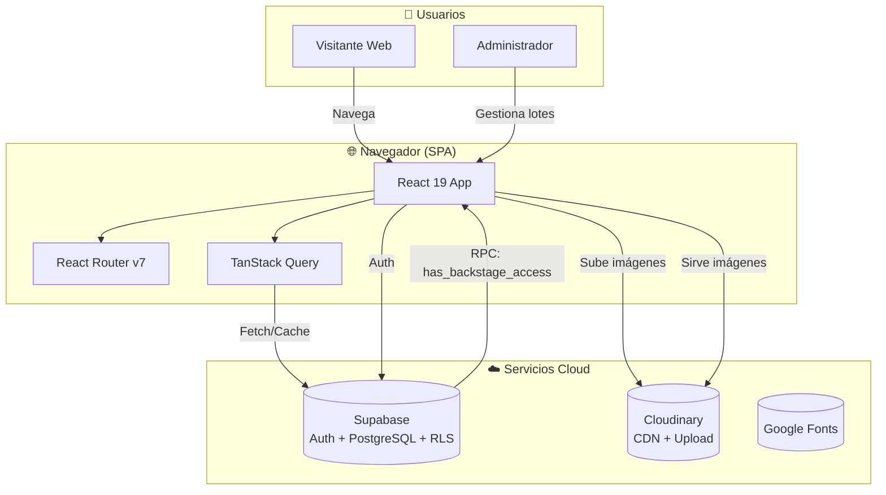
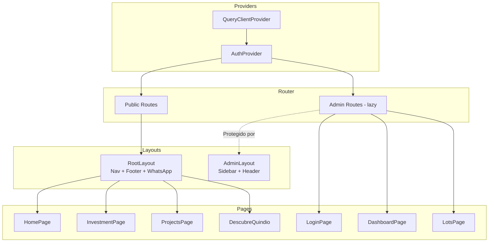
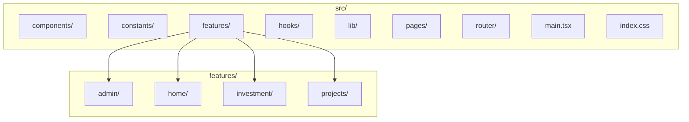

---
tags:
  - architecture
  - overview
created: 2026-07-21
---

# 🏗️ Arquitectura del Proyecto

> 📊 **Diagramas interactivos disponibles en:** [[docs/diagrams/architecture|Diagramas de Arquitectura]]
>
> Los diagramas usan sintaxis **Mermaid**, compatible nativamente con Obsidian.  
> En Obsidian: usa `Ctrl/Cmd + Click` para navegar o vista `Preview` para renderizar.

---

## Diagrama de Contexto del Sistema



## Diagrama de Componentes



---

## 📂 Estructura del Código



### Descripción de Directorios

| Directorio | Propósito |
|-----------|-----------|
| `components/` | Componentes globales reutilizables (layout, UI, SEO) |
| `constants/` | Datos estáticos e inmutables (lotes, stats, nav, proyecto) |
| `features/` | Módulos feature-based: cada feature tiene su página y componentes |
| `hooks/` | Custom hooks globales (auth, scroll reveal, tracking) |
| `lib/` | Clientes e integraciones (Supabase, Cloudinary, checkAdmin) |
| `pages/` | Páginas independientes sin feature module propio |
| `router/` | Configuración de React Router (rutas + code splitting) |

---

## 🧩 Principios Arquitectónicos

### 1. Feature-Based Organization
Los módulos se organizan por **dominio funcional** (`features/`) en lugar de por tipo técnico. Cada feature contiene sus propios componentes, lógica y estado. Esto facilita:

- **Mantenibilidad:** Cada feature es autocontenida
- **Escalabilidad:** Nuevas features no afectan las existentes
- **Code Splitting:** Las features se pueden cargar bajo demanda

### 2. Code Splitting Estratégico
El panel administrativo se carga **bajo demanda** mediante `React.lazy()` + `Suspense`. Esto:
- Reduce el bundle inicial en ~40%
- Oculta nombres de tablas administrativas del bundle público
- Mejora el rendimiento percibido en dispositivos móviles

```typescript
const AdminLayout = lazy(() => 
  import("@/features/admin/components/AdminLayout")
    .then(m => ({ default: m.AdminLayout }))
);
```

### 3. Estado y Data Fetching
- **TanStack React Query** para caché de datos del servidor (configurado en `main.tsx` como `QueryClientProvider`)
- **React Context** para estado de autenticación (`AuthProvider`)
- **Datos estáticos** (lotes, stats) viven en `constants/` como objetos inmutables `as const`

### 4. CSS-first Theming (Tailwind v4)
Tailwind CSS v4 con configuración CSS-first mediante `@theme`. Sin archivo `tailwind.config.js`:

```css
@theme {
  --color-primary: #1B4332;
  --color-soft-gold: #D4A373;
  --font-display-lg: "Playfair Display", serif;
}
```

### 5. Autenticación Delegada
Supabase Auth maneja todo el ciclo de vida de sesiones (login, refresh, logout). El frontend solo consume el estado vía `onAuthStateChange`. La verificación de rol admin se hace mediante una función RPC en PostgreSQL (`has_backstage_access`).

### 6. Import Map para Supabase SDK
`@supabase/supabase-js` se carga desde CDN (esm.sh) vía Import Map en lugar de empaquetarse, para:
- Reducir el tamaño del bundle
- Evitar falsos positivos de react-doctor
- Aprovechar el caché del navegador

---

## 🔐 Consideraciones de Seguridad

| Aspecto | Implementación |
|---------|---------------|
| Rutas protegidas | `AdminGuard.tsx` verifica auth + rol admin |
| RLS en BD | Políticas Row Level Security en Supabase |
| Secrets | Variables de entorno (`VITE_*`) nunca hardcodeadas |
| Bundle seguro | Import Map evita exponer strings de Supabase |
| Admin verification | Server-side via RPC PostgreSQL |

---

## 📐 Decisiones Técnicas Relacionadas

- [[docs/decisions/adr-001-react-router-code-splitting|ADR-001: Code Splitting]]
- [[docs/decisions/adr-002-tailwind-css-v4-theme|ADR-002: Tailwind v4 CSS-first]]
- [[docs/decisions/adr-003-supabase-auth|ADR-003: Auth con Supabase]]
- [[docs/decisions/adr-004-import-map-supabase|ADR-004: Import Map Supabase]]

## 🔗 Enlaces Relacionados

- [[docs/diagrams/architecture|📊 Diagramas de Arquitectura (Mermaid)]]
- [[docs/guides/onboarding|🚀 Guía de Onboarding]]
- [[docs/stack/tech-stack|⚙️ Stack Tecnológico]]
