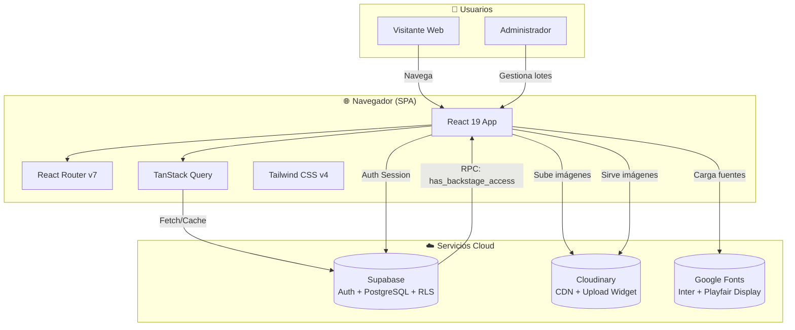
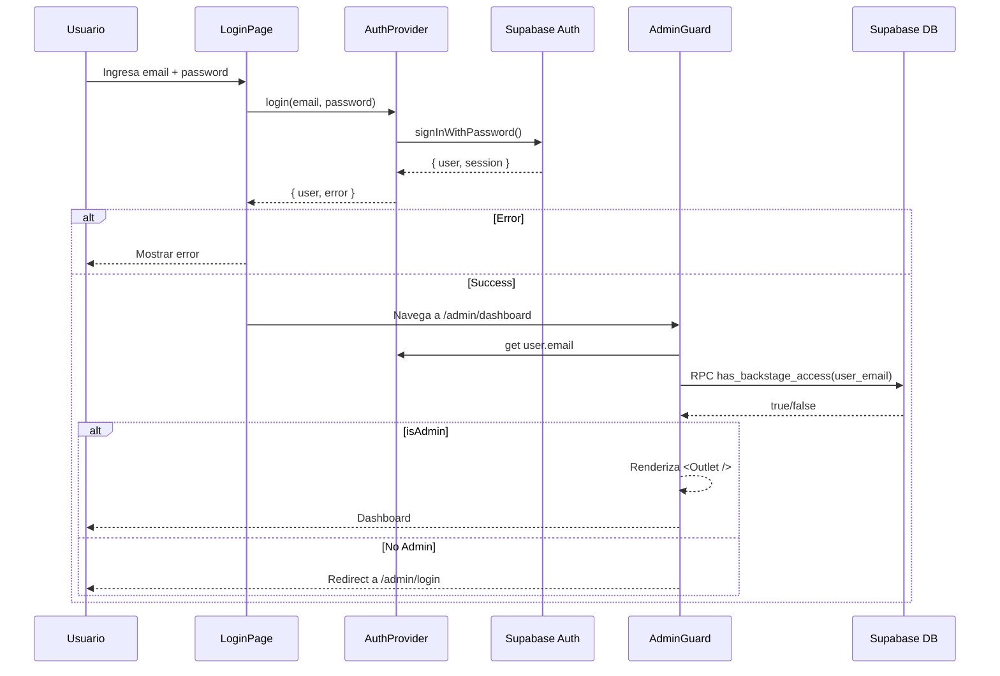
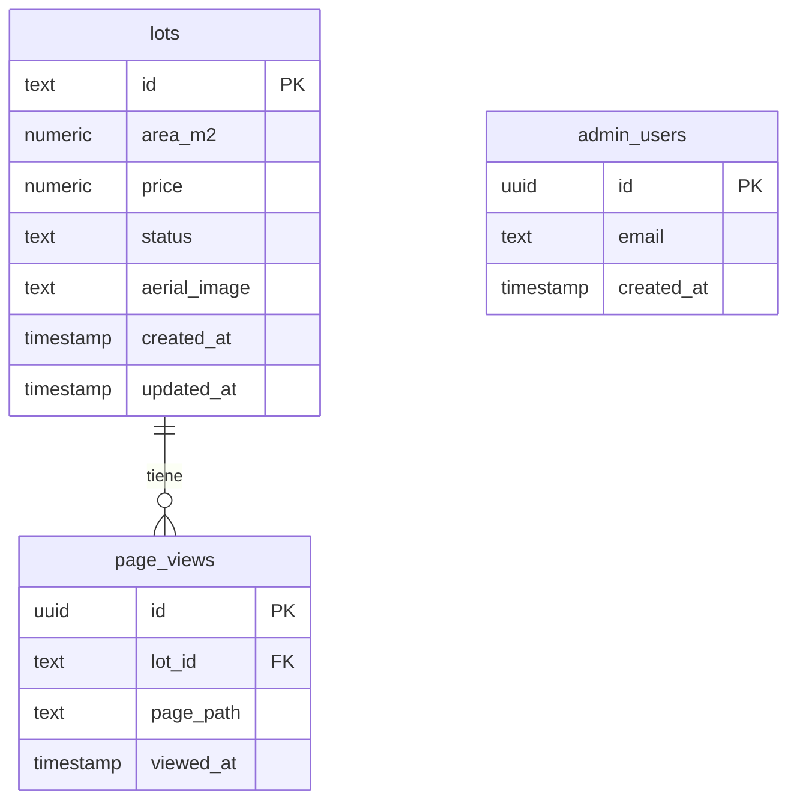
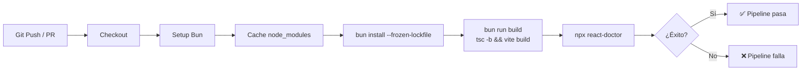
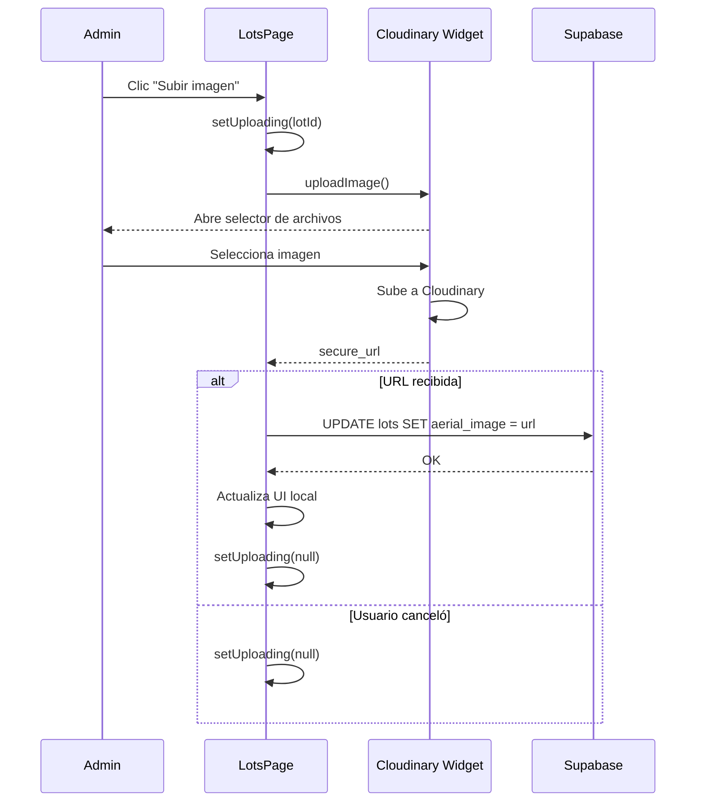

---
tags:
  - diagrams
  - mermaid
  - drawio
  - architecture
created: 2026-07-21
updated: 2026-07-21
---

# 📊 Diagramas del Proyecto

Este directorio contiene todos los diagramas de arquitectura del proyecto en dos formatos:

---

## 🎨 Diagramas Draw.io (Editables)

> Recomendados para edición visual. Abrir con [draw.io](https://app.diagrams.net) o extensión VS Code.

| Archivo | Contenido | Vista Previa |
|---------|-----------|--------------|
| [arquitectura.drawio](./arquitectura.drawio) | 🏗️ Arquitectura general del sistema: 3 capas (navegador → lógica → servicios cloud) con todos los componentes React, rutas admin protegidas, y conexiones a Supabase/Cloudinary | Diagrama completo del sistema |
| [auth-flow.drawio](./auth-flow.drawio) | 🔐 Flujo de autenticación paso a paso: Usuario → LoginPage → AuthProvider → Supabase Auth → AdminGuard → RPC → Dashboard o Redirect | Secuencia de auth con 9 pasos numerados |
| [database-routing.drawio](./database-routing.drawio) | 🗄️ Esquema de base de datos (tablas `lots`, `admin_users`, funciones RPC, RLS) + 🌳 Árbol completo de rutas de React Router | Dos diagramas en uno: BD + Routing |

### Cómo abrir los archivos .drawio

1. **Opción 1 — draw.io online:** Arrastra el archivo a [app.diagrams.net](https://app.diagrams.net/)
2. **Opción 2 — VS Code:** Instala la extensión "Draw.io Integration" y haz clic en el archivo
3. **Opción 3 — Obsidian:** Usa el plugin "Obsidian Draw.io" (recomendado)

---

## 📝 Diagramas Mermaid (Integrados en Markdown)

> Renderizables nativamente en Obsidian. No requieren plugins.

### 1. Diagrama de Contexto del Sistema (C4 Nivel 1)



### 2. Diagrama de Componentes React

```mermaid
graph TB
    subgraph "main.tsx (Entry)"
        MAIN[createRoot]
    end

    subgraph "Providers"
        QUERY_PROV[QueryClientProvider]
        AUTH_PROV[AuthProvider<br/>useAuth.tsx]
    end

    subgraph "Router<br/>router/index.tsx"
        ROUTER_MAIN[createBrowserRouter]
        PUBLIC[Public Routes]
        ADMIN[Admin Routes<br/>lazy()]
    end

    subgraph "Layouts"
        ROOT[RootLayout]
        ADMIN_LAYOUT[AdminLayout]
    end

    subgraph "Public Pages"
        HOME[HomePage]
        INVEST[InvestmentPage]
        PROJ[ProjectsPage]
        PROJ_DETAIL[ProjectDetailPage<br/>projects/:id]
        QUINDIO[DescubreQuindio]
    end

    subgraph "Admin Pages (Code Split)"
        LOGIN[LoginPage]
        DASH[DashboardPage]
        LOTS[LotsPage]
        GUARD[AdminGuard]
    end

    MAIN --> QUERY_PROV
    QUERY_PROV --> AUTH_PROV
    AUTH_PROV --> ROUTER_MAIN
    ROUTER_MAIN --> PUBLIC
    ROUTER_MAIN --> ADMIN
    PUBLIC --> ROOT
    ROOT --> HOME
    ROOT --> INVEST
    ROOT --> PROJ
    ROOT --> PROJ_DETAIL
    ROOT --> QUINDIO
    ADMIN --> GUARD
    GUARD --> ADMIN_LAYOUT
    ADMIN_LAYOUT --> DASH
    ADMIN_LAYOUT --> LOTS
    ADMIN --> LOGIN
```

### 3. Flujo de Autenticación (Secuencia)



### 4. Esquema de Base de Datos (ERD)



### 5. Pipeline CI/CD



### 6. Estructura de Archivos (Código)

```mermaid
graph TB
    subgraph "src/"
        SRC_COMPONENTS[components/]
        SRC_CONSTANTS[constants/]
        SRC_FEATURES[features/]
        SRC_HOOKS[hooks/]
        SRC_LIB[lib/]
        SRC_PAGES[pages/]
        SRC_ROUTER[router/]
        SRC_MAIN[main.tsx]
        SRC_CSS[index.css]
    end

    subgraph "components/"
        LAYOUT[layout/<br/>RootLayout, TopNav<br/>BottomNav, Footer]
        UI[ui/<br/>LazyImage, WhatsAppButton]
        SEO[seo/<br/>PageSEO]
        QUI[quindio/<br/>CulturalHeritage, WellnessSection]
        HOME_C[home/<br/>HomeCarousel]
    end

    subgraph "features/"
        ADMIN[admin/<br/>Dashboard, Login, Lots]
        HOME_F[home/<br/>Hero, FeaturedLots, ContactForm]
        INVEST[investment/<br/>InvestmentHero, RoiAnalysis]
        PROJECTS[projects/<br/>LotCard, LotFilters, LotGallery]
    end

    subgraph "hooks/"
        AUTH[useAuth.tsx]
        AUTH_CTX[useAuthContext.ts]
        SCROLL[useScrollReveal.ts]
        TRACK[useTrackPageView.ts]
    end

    subgraph "lib/"
        SUPABASE_LIB[supabase.ts]
        CLOUD_LIB[cloudinary.ts]
        ADMIN_LIB[checkAdmin.ts]
    end

    SRC_MAIN --> SRC_ROUTER
    SRC_MAIN --> SRC_CSS
    SRC_ROUTER --> SRC_FEATURES
    SRC_FEATURES --> ADMIN
    SRC_FEATURES --> HOME_F
    SRC_FEATURES --> INVEST
    SRC_FEATURES --> PROJECTS
    SRC_ROUTER --> SRC_COMPONENTS
    SRC_COMPONENTS --> LAYOUT
    SRC_COMPONENTS --> UI
    SRC_COMPONENTS --> SEO
    SRC_COMPONENTS --> QUI
    SRC_COMPONENTS --> HOME_C
    SRC_FEATURES --> SRC_CONSTANTS
    SRC_FEATURES --> SRC_HOOKS
    SRC_HOOKS --> AUTH
    SRC_HOOKS --> AUTH_CTX
    SRC_HOOKS --> SCROLL
    SRC_HOOKS --> TRACK
    SRC_FEATURES --> SRC_LIB
    SRC_LIB --> SUPABASE_LIB
    SRC_LIB --> CLOUD_LIB
    SRC_LIB --> ADMIN_LIB
```



### 7. Flujo de Subida de Imágenes



---

## 🔗 Enlaces Relacionados

- [📋 Índice de Documentación](../index.md)
- [🏗️ Arquitectura del Proyecto](../architecture/overview.md)
- [🚀 Guía de Onboarding](../guides/onboarding.md)
- [🔐 Sistema de Autenticación](../features/authentication.md)
- [🗄️ Base de Datos](../features/database.md)
- [🗺️ Sistema de Enrutamiento](../features/routing.md)
